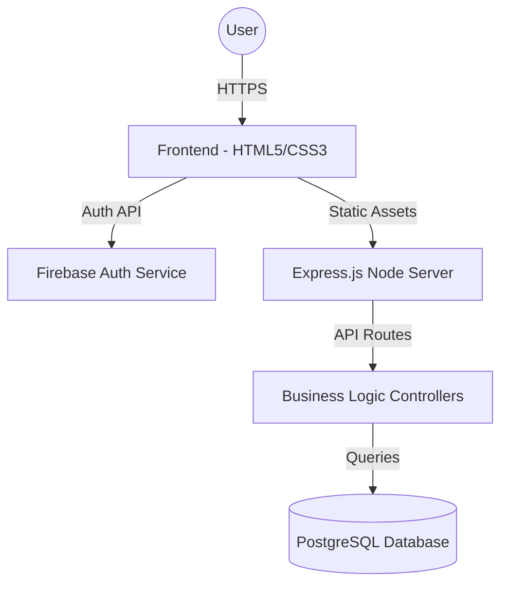
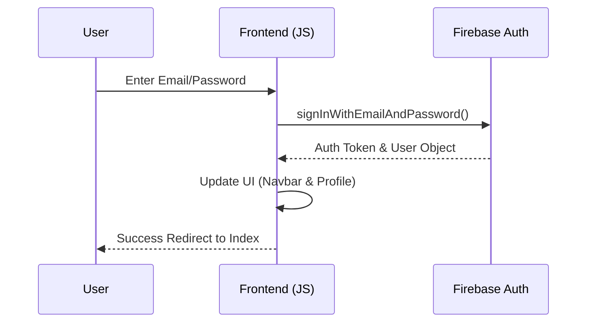

# 🛒 ForgeCart – Premium Developer Gear

## 📌 Overview

**ForgeCart** is a modern, full-stack ready e-commerce application developed for the **BackForge Hackathon**. It features a stunning glassmorphism UI, a robust product catalog, and integrated **Firebase Authentication** for secure user onboarding.

This project serves as a premium foundation for building a developer-centric marketplace, combining high-end design with real-world functionality.

---

## 🚀 Key Highlights

*   🛡️ **Firebase Authentication**: Secure Register, Login, and Session management.
*   💎 **Glassmorphism UI/UX**: Modern, premium storefront design.
*   📱 **Fully Responsive**: Optimized for Desktop, Tablet, and Mobile.
*   ⚡ **Injected Backend**: Express.js server serving static assets and API ready.
*   📦 **Modular Architecture**: Clean separation of logic, styles, and components.

---

## 🏗️ System Architecture

ForgeCart utilizes a specialized architecture designed for performance and scalability:



### 🔹 Implementation Layers

| Layer | Responsibility | Technologies | Status |
| :--- | :--- | :--- | :--- |
| **Identity** | User Auth, Session, Profile | Firebase Auth | ✅ Implemented |
| **Frontend** | UI/UX, Navigation, Interactions | HTML5, CSS3, JS Modules | ✅ Implemented |
| **Logic** | API Routes, Middleware, Auth Handling | Node.js, Express.js | 🏗️ In Progress |
| **Storage** | Product Data, Orders, Cart Persistence | PostgreSQL, pg-node | 🏗️ In Progress |

---

## 🔐 Authentication Flow

The application uses a secure, event-driven authentication flow:



---

## 🛍️ Feature Implementation Status

### 🏠 Storefront & Search
| Feature | Description | Status |
| :--- | :--- | :--- |
| **Product Grid** | Premium gear listing with glassmorphism cards. | ✅ Completed |
| **Search UI** | Interactive search bar for digital and physical assets. | ✅ Completed |
| **Category Filer** | Filter by Clothing, Digital Assets, Accessories. | ✅ Completed |

### 🔐 User Account
| Feature | Description | Status |
| :--- | :--- | :--- |
| **Registration** | New user onboarding with email verification ready. | ✅ Completed |
| **Login** | Secure access to account and orders. | ✅ Completed |
| **Logout** | Session termination across all pages. | ✅ Completed |
| **Profile Sync** | Dynamic navbar updates with user display name. | ✅ Completed |

---

## 🧰 Tech Stack

| Category | technology |
| :--- | :--- |
| **Core** | HTML5, CSS3, Vanilla JavaScript (ES6 Modules) |
| **Backend** | Node.js, Express.js |
| **Security** | Firebase Authentication |
| **Database** | PostgreSQL |
| **Icons** | Font Awesome 6.4.0 |
| **Typography** | Google Fonts (Outfit, Inter) |

---

## 📁 Project Structure

```bash
/
├── js/
│   ├── auth-logic.js      # Firebase Auth implementation
│   ├── firebase-config.js # Firebase initialization
│   └── ui-handler.js      # Global UI state management
├── src/
│   ├── app.js             # Express application & Static serving
│   ├── controllers/       # API route handlers
│   └── routes/            # Backend API definitions
├── css/                   # Global and component stylesheets
├── assets/                # Product images and branding
├── index.html             # Storefront / Dashboard
├── login.html             # Secure Access
└── register.html          # New User Onboarding
```

---

## 📱 Responsiveness

ForgeCart is optimized for the modern developer workspace:

*   **Desktop 💻**: Full multi-column grid layouts for 4K and ultrawide monitors.
*   **Tablet 📱**: Optimized touch targets and reflowing content.
*   **Mobile 📲**: Mobile-first approach with a focus on ease of navigation.

---

## 🎯 Purpose

ForgeCart is designed to help hackathon participants and developers skip the repetitive UI setup and jump straight into building complex backend logic. It provides a **production-grade UI** coupled with **ready-to-use authentication**.

---

## 🤝 Contribution

This project is part of the **BackForge Hackathon ecosystem**.
Feel free to fork, extend, and integrate your backend solutions.

💡 *Build fast. Ship faster. Forge better.*

---

## 📜 License

Distributed under the MIT License. See `LICENSE` for more information.
