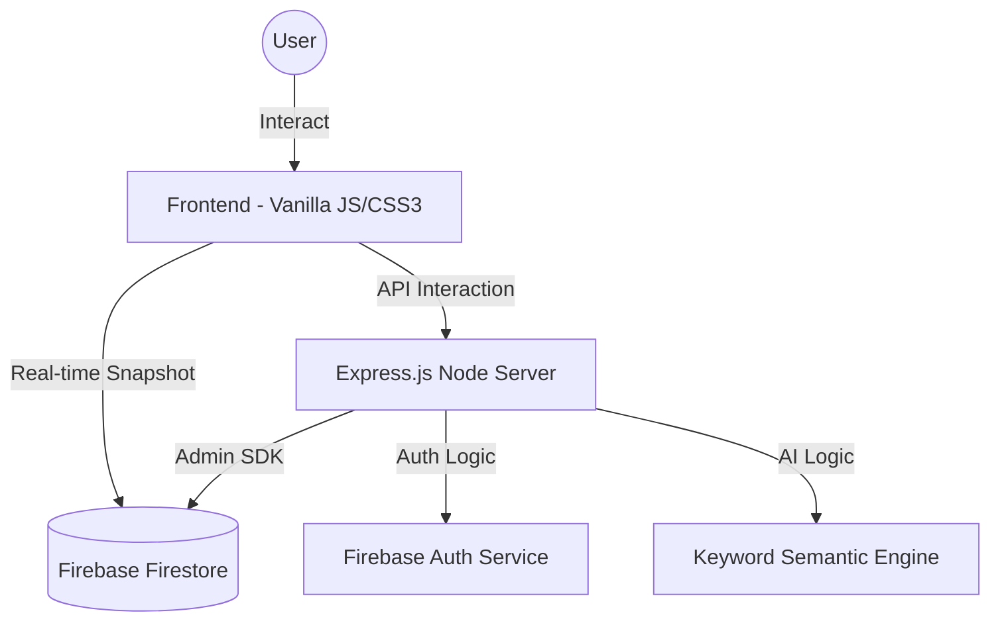

# 🛒 ForgeCart – Premium Developer Marketplace

## 📌 Overview

**ForgeCart** is a production-grade, full-stack developer marketplace designed for the modern engineering ecosystem. Originally a prototype for the **BackForge Hackathon**, it has been upgraded into a resilient, **Firebase-powered** platform featuring high-end glassmorphism design, real-time data synchronization, and AI-driven interactions.

This project serves as a premium foundation for building a scalable marketplace, combining state-of-the-art frontend aesthetics with a robust, event-driven backend.

---

## 🚀 Key Highlights

*   🔥 **Full Firestore Migration**: Complete transition from relational databases to a scalable, document-oriented Firestore architecture.
*   ⚡ **Real-Time Syncing**: Instant synchronization of cart data and trending assets across all devices using Firestore listeners.
*   🤖 **AI Shopping Assistant**: Semantic-powered assistance to help developers find gear based on their tech stack and project needs.
*   🛡️ **Admin Dashboard**: A secure, RBAC (Role-Based Access Control) powered control center for managing inventory, orders, and users.
*   ⚙️ **Agentic Automations**: Rule-based system for "Trigger → Condition → Action" workflows (e.g., price drop alerts).
*   🌓 **Theme Engine**: Seamless Light/Dark mode transitions with persistence, maintaining the core glassmorphism aesthetic.
*   📦 **Digital Asset Fulfillment**: Secure delivery logic for digital products with instant download access.

---

## 🏗️ System Architecture

ForgeCart utilizes a hybrid Firebase architecture designed for performance and real-time interactions:

### 🔹 Logic & Data Flow



### 🔹 Technical Layers

| Layer | Responsibility | Technologies |
| :--- | :--- | :--- |
| **Real-Time Data** | Live Cart/Trending updates | Firestore SDK (`onSnapshot`) |
| **Identity** | User Auth, RBAC, Profile Storage | Firebase Auth + Firestore User Docs |
| **Intelligence** | Product Recommendations | Custom AI Controller / Semantic Search |
| **Storefront** | UI/UX, Navigation, Interactions | HTML5, CSS3, JS Modules |
| **Operations** | Admin Controls, Order Management | Node.js, Express.js (Admin SDK) |

---

## 🔥 New Production Features

### 🏢 Real-Time Marketplace
| Feature | Description | Status |
| :--- | :--- | :--- |
| **Live Cart** | No refreshing needed. Cart updates instantly when items are added/modified. | ✅ Implemented |
| **Trending Sync** | Homepage "Trending Now" section reflects real-time product popularity. | ✅ Implemented |

### 🤖 Forge AI Assistant
Describe your project or tech stack, and the AI Assistant will optimize your shopping experience by recommending relevant gear, hoodies, or digital assets.

### ⚙️ Agentic Automation System
Set up intelligent monitoring protocols to stay ahead of the marketplace:
*   **Trigger**: New products, price drops, or restock events.
*   **Condition**: Filter by category, max price, or specific product IDs.
*   **Action**: Receive real-time in-app notifications with deep links to products.
*   **AI Generator**: Use natural language to quickly spin up new automation rules.

### 🌓 Advanced UI & Theme Engine
*   **Persistent Theme**: Automatically remembers your Light or Dark mode preference.
*   **Precision Transitions**: Elegant micro-animations and CSS variable-driven styling.

### 🛠️ Mission Control (Admin)
Secure access for administrators to:
*   Add, edit, or delete marketplace items.
*   Monitor order logs and update transaction statuses.
*   Oversee the registered developer community.

---

## 🧰 Tech Stack

| Category | Technology |
| :--- | :--- |
| **Frontend** | HTML5, CSS3, Vanilla JavaScript (ES6 Modules) |
| **Real-Time DB** | Firebase Firestore (NoSQL) |
| **Auth & RBAC** | Firebase Authentication + Firestore Roles |
| **Backend API** | Node.js, Express.js |
| **Icons** | Font Awesome 6.4.0 |
| **Design System** | Glassmorphism with Theme Engine variables |

---

## 📁 Project Structure

```bash
/
├── js/
│   ├── auth-logic.js      # Firebase Auth implementation
│   ├── db-service.js      # Real-time Firestore listeners
│   ├── ui-handler.js      # Theme & dynamic UI management
│   ├── storefront.js      # Storefront rendering & logic
│   └── admin.js           # Admin Dashboard frontend
├── src/
│   ├── app.js             # API & Server entry
│   ├── controllers/       # AI, Cart, Order, and Product logic
│   ├── routes/            # Backend API definitions (Admin, AI, Auth)
│   └── data/              # DB Seeding & Store definitions
├── css/                   # Dynamic Theme styling
├── admin.html             # Administrative Mission Control
├── index.html             # Marketplace Home
└── product.html           # Deep Asset Details
```

---

## 🚀 Getting Started

1.  **Environment Setup**: Copy `.env.example` to `.env` and fill in your Firebase credentials.
2.  **Initialize Database**: Run `node src/data/seedFirestore.js` to sync the marketplace catalog.
3.  **Start Server**: `npm run dev` to launch the platform locally.
4.  **Admin Access**: User with email `omkarrane0934@gmail.com` is auto-bootstrapped with admin privileges.

---

Used Antigravity for coding.

---

## 📜 License

Distributed under the MIT License. Built for the **BackForge Hackathon**.

💡 *Build fast. Ship faster. Forge better.*

